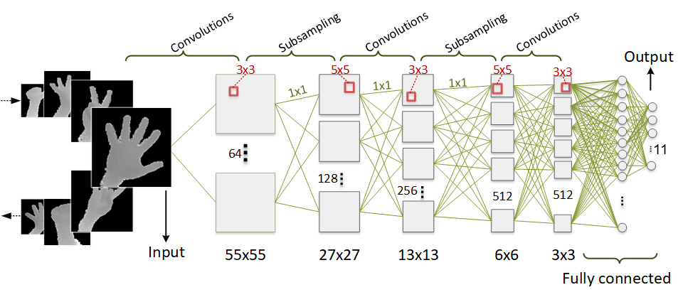
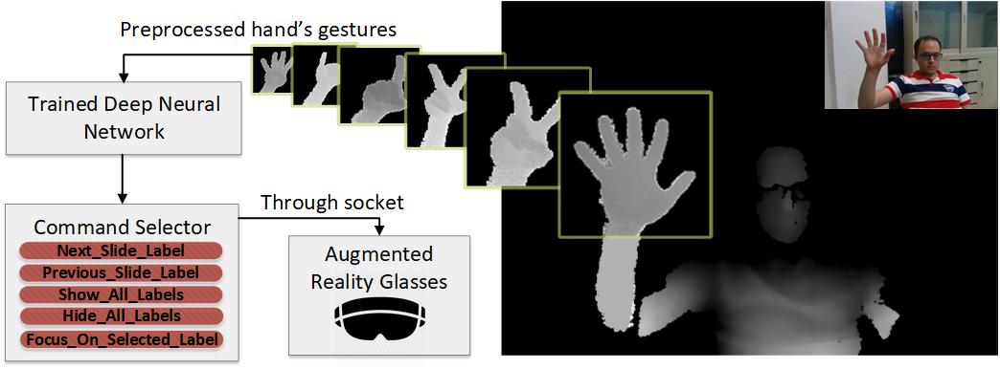

# Deep-Gesture-Recognizer_KERAS

Implementation of hand gesture recognition using Convolutional Neural Network

Our CNN architecture:

Procedure of using gesture data and sending a command to augmented reality application:

